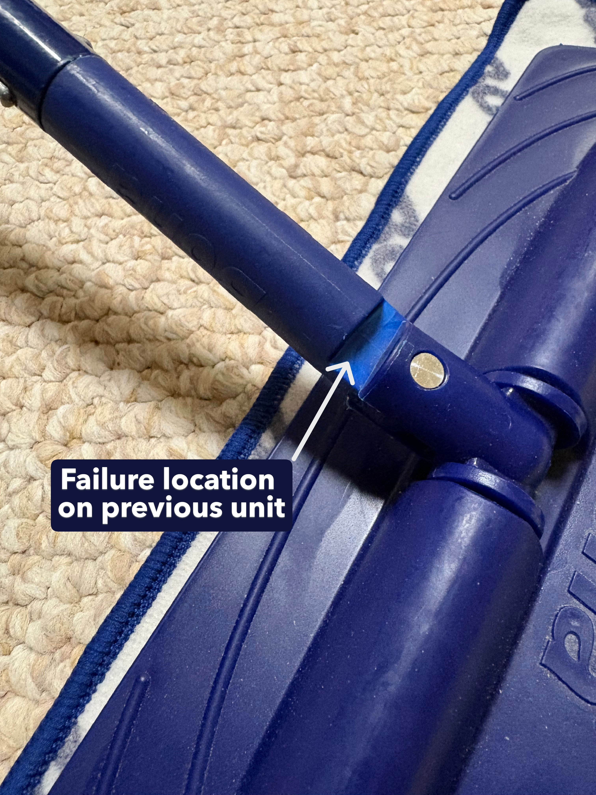
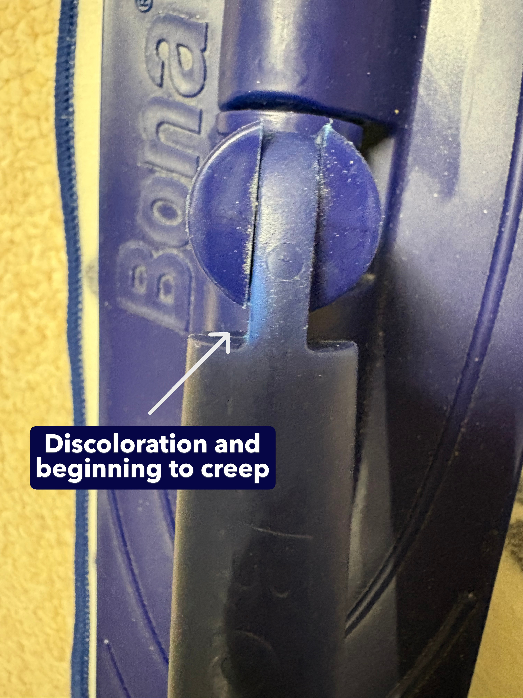
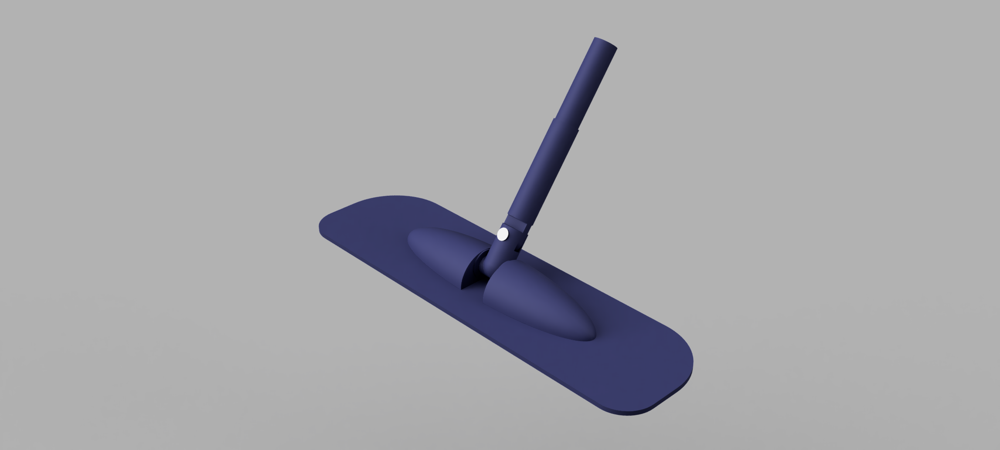
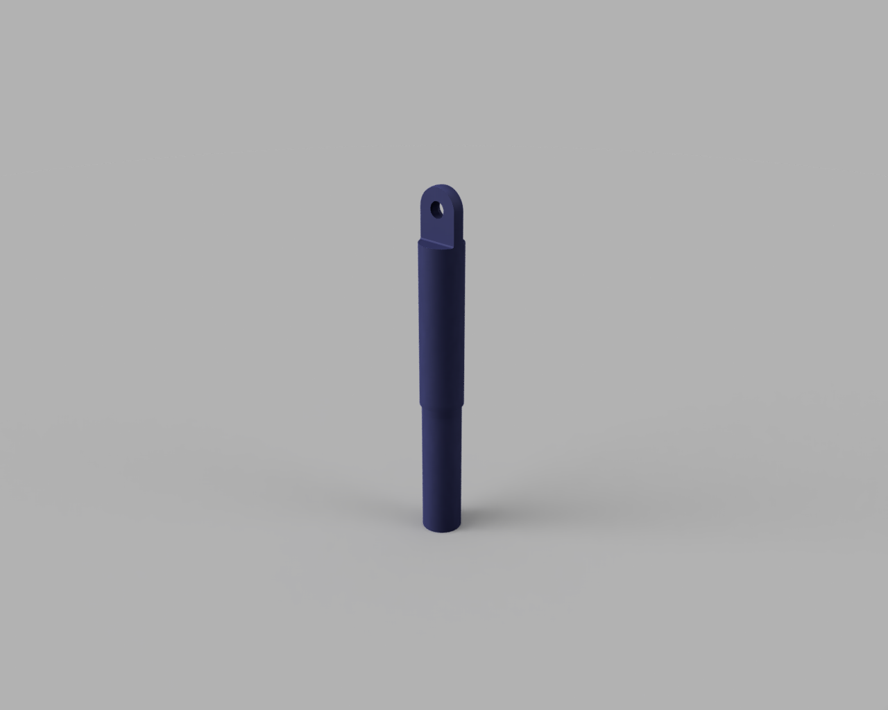
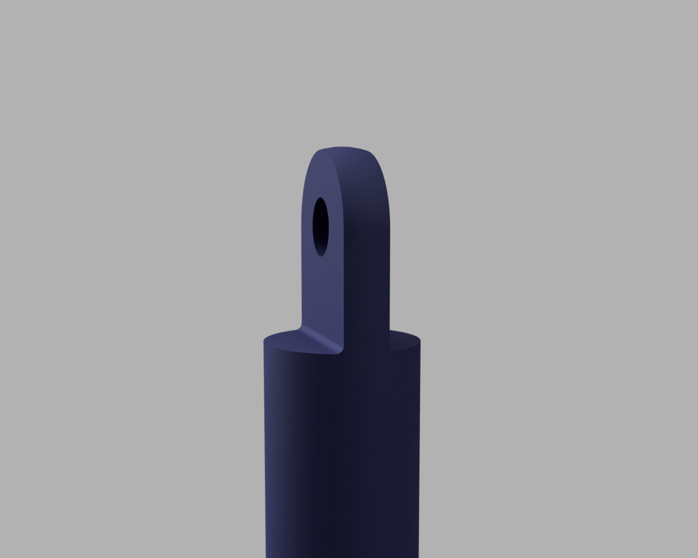

# Mop Joint Redesign

## Overview 
The Bona mop is used for cleaning and maintaining hardwood flooring. After just a couple of years, my first mop failed at a thin, filleted section near the joint between the handle and mop head, and now my second unit is showing similar signs of expected failure. I investigated the root cause and developed a redesigned geometry to reduce stress concentrations and improve durability. Using CAD modeling and finite element analysis, I evaluated the original design and iteratively refined the model, achieving over a 60% reduction in peak stress.

## Problem Definition
The mop head is connected to the handle via a double-pivoting joint, allowing for multi-axis motion. The failure occurred in the plastic component at the end of the handle, specifically at the protruding section where a pin connects it to the intermediate joint piece. This section is relatively thin (~1/4") with a small fillet radius (~5/128") at its base. This sharp transition creates a stress concentration under the bending loads applied during typical use. This repeated loading and stress concentration led to visible signs of material degradation, including discoloration and deformation (creep). Since my replacement mop is experiencing the same symptoms as my first mop, this suggests a design flaw rather than an isolated incident.

The objective of this project was to reduce stress concentrations in this critical section through a geometric redesign, which would improve the durability and lifespan of the component.

 

## Engineering Analysis
To better understand the root cause of failure, I modeled the failing part in Autodesk Fusion. As force is applied through the handle, the geometry creates a bending moment at the cantilevered section of the failing part. I applied a simplified loading case of 50 N at 45° to represent a typical mopping motion.

Based on standard stress concentration charts for a filleted bar in bending (D/d ≈ 3, r/d ≈ 0.16), the estimated stress concentration factor K ≈ 1.5. This indicates that local stresses at the fillet could be roughly 50% higher than the nominal bending stress.

My initial hand calculations suggested that the stresses under typical forces will remain well below the material's yield strength, indicating that static failure is unlikely to be the primary cause of failure. Instead, the observed discoloration, creep, and cyclic nature of loading that occurs during mopping indicate that fatigue failure is more likely to occur.

This analysis established that reducing local stress concentrations through a geometric redesign of the fillet radius would improve fatigue resistance and long-term durability without requiring major changes to the part geometry or manufacturing process.

## CAD Model & FEA Results
### Original Configuration - 5/128" fillet radius

<video width="1280" height="720" controls>
  <source src="../images/Config 1 VM Stress.mp4" type="video/mp4">
  
</video>

## Iterations

### Configuration 2 - 1/16" fillet radius

<video width="1280" height="720" controls>
  <source src="../images/Config 2 VM Stress.mp4" type="video/mp4">
  Your browser does not support the video tag.
</video>

### Configuration 3 - 1/8" fillet radius

<video width="1280" height="720" controls>
  <source src="../images/Config 3 VM Stress.mp4" type="video/mp4">
  Your browser does not support the video tag.
</video>

### Configuration 4 - 1/4" fillet radius

<video width="1280" height="720" controls>
  <source src="../images/Config 4 VM Stress.mp4" type="video/mp4">
  Your browser does not support the video tag.
</video>

## Results
(text)

## Key Takeaways
(text)
