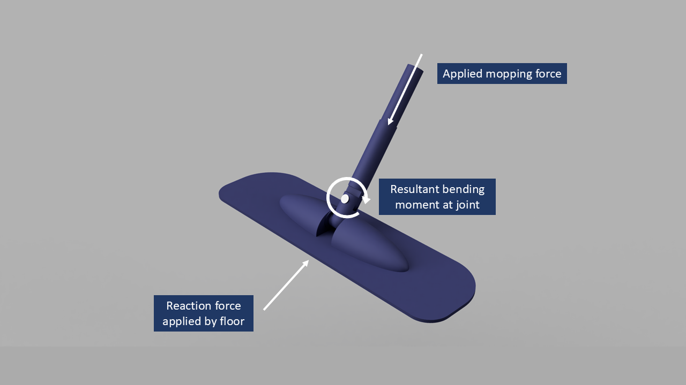
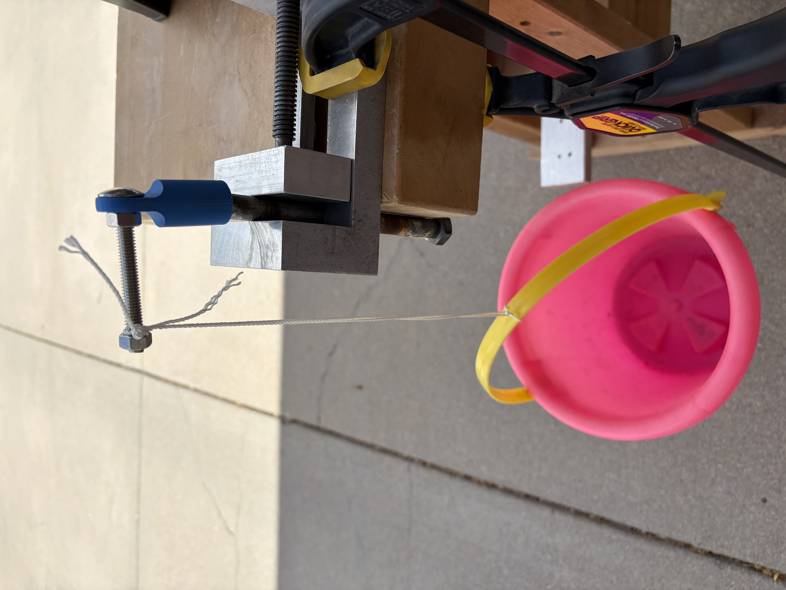
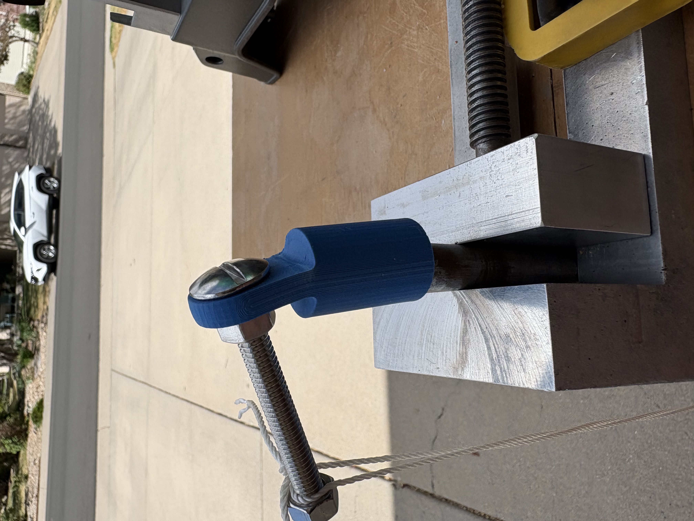
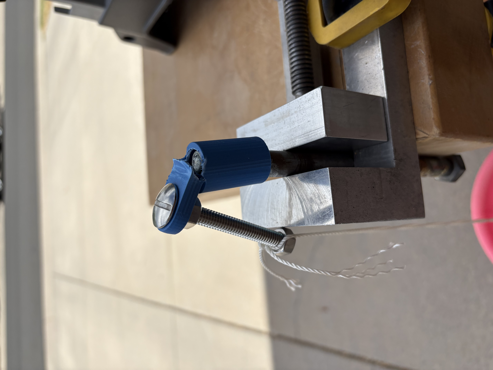
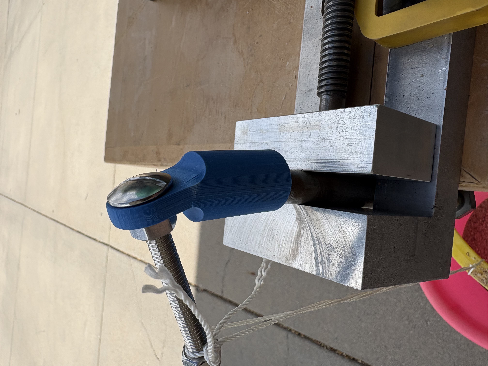
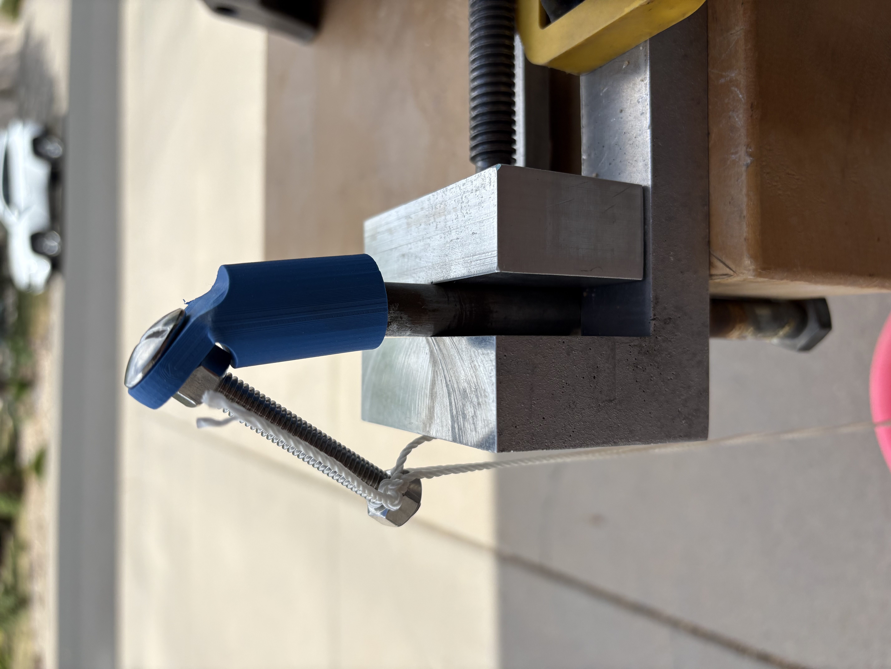

# Mop Joint Redesign
**Tools:** Autodesk Fusion | FEA | Mechanical Design | Failure Analysis | 3D Printing

**Key Results**
- 61% reduction in peak Von Mises stress
- ~11% increase in experimental failure load
- Improved durability through fillet radius redesign

## Overview
The Bona hardwood floor mop uses a double-pivoting joint to connect the handle to the mop head. After repeated use, my first mop failed at a thin, filleted section near the joint, and my replacement unit began showing similar signs of expected failure.

I investigated the root cause and developed a redesigned geometry to reduce local stress concentrations and improve durability. Using CAD modeling and finite element analysis (FEA), I evaluated the original design and iteratively refined the geometry, achieving over a 60% reduction in peak stress.

## Problem Definition
## Problem Definition

The mop head is connected to the handle through a plastic double-pivoting joint that allows multi-axis motion during use. Failure occurred at the protruding section where a pin connects the handle joint to the intermediate assembly.

Key observations:
- Thin cantilevered section (~1/4")
- Small fillet radius (~5/128")
- Visible discoloration and deformation (creep)
- Repeated failure across multiple units

This sharp geometric transition creates localized stress under bending loads during normal mopping motion. The repeated loading and stress concentration likely contributed to progressive material degradation and eventual failure.

### Project Objective
Reduce local stress concentrations through geometric redesign while maintaining the original functionality and manufacturability of the part.

  

    
  

  

    
  

## Engineering Analysis
To better understand the root cause of failure, I modeled the original joint geometry in Autodesk Fusion and evaluated the loading conditions experienced during normal use.

Assumptions:
- Mopping force: ~50 N
- Force angle: ~45°
- Resulting bending moment at joint: ~0.2 N·m

The cantilevered geometry creates a localized bending stress at the filleted transition near the pivot connection. Based on standard stress concentration charts for a filleted bar in bending (D/d ≈ 3, r/d ≈ 0.16), the estimated stress concentration factor was approximately K ≈ 1.5.

Initial hand calculations suggested that stresses remained below the material’s yield strength under typical loading conditions, indicating that immediate static failure was unlikely. Instead, the observed creep, discoloration, and cyclic loading during use suggest that fatigue-related failure was more likely.

This analysis indicated that increasing the fillet radius would reduce local stress concentrations and improve long-term durability without major changes to the overall geometry or manufacturing process.

## CAD Models & FEA Results
I modeled the joint component based on measurements of the original part. This model was used as the baseline for the analysis and design iterations. As is observed in the FEA analyses below, the cantilevered geometry demonstrates a clear stress concentration scenario, where abrupt changes in cross-section amplify local stresses under bending. As the fillet radius increases, the transition in cross-section becomes smoother, resulting in smaller stress concentrations.

### Original Configuration - 5/128" fillet radius

  

    
    
<em>Original Configuration CAD model</em>

  

  

    <video controls playsinline webkit-playsinline
           style="width: 100%; height: 100%; object-fit: contain;">
      <source src="../assets/videos/Config 1 VM Stress.mp4" type="video/mp4">
    </video>
    
<em>Original Configuration FEA simulation</em>

  

The original configuration has a fillet radius of 5/128". Under the simulated loading conditions, the resulting Von Mises stress peaks at around 1.66 MPa (240 psi). The estimated yield strength of HDPE typically ranges from about 18 - 30 MPa (2600 - 4500 psi).

### Configuration 2 - 1/16" fillet radius

  

    
    
<em>Configuration 2 CAD model</em>

  

  

    <video controls playsinline webkit-playsinline
           style="width: 100%; height: 100%; object-fit: contain;">
      <source src="../assets/videos/Config 2 VM Stress.mp4" type="video/mp4">
    </video>
    
<em>Configuration 2 FEA simulation</em>

  

The second configuration has a fillet radius of 1/16". Under the same loading conditions, the resulting Von Mises stress peaks at around 1.45 MPa (210 psi). This is a reduction of approximately 13%.

### Configuration 3 - 1/8" fillet radius

  

    
    
<em>Configuration 3 CAD model</em>

  

  

    <video controls playsinline webkit-playsinline
           style="width: 100%; height: 100%; object-fit: contain;">
      <source src="../assets/videos/Config 3 VM Stress.mp4" type="video/mp4">
    </video>
    
<em>Configuration 3 FEA simulation</em>

  

The third configuration has a fillet radius of 1/8". Under the same loading conditions, the resulting Von Mises stress peaks at around 0.84 MPa (122 psi). This is a reduction of approximately 49%.

### Configuration 4 - 1/4" fillet radius

  

    
    
<em>Configuration 4 CAD model</em>

  

  

    <video controls playsinline webkit-playsinline
           style="width: 100%; height: 100%; object-fit: contain;">
      <source src="../assets/videos/Config 4 VM Stress.mp4" type="video/mp4">
    </video>
    
<em>Configuration 4 FEA simulation</em>

  

The fourth configuration has a fillet radius of 1/4". Under the same loading conditions, the resulting Von Mises stress peaks at around 0.65 MPa (94 psi). This is a reduction of approximately 61%.

While increasing the fillet radius significantly reduced local stress, the returns in stress reduction start to slow down as the fillet grows. Also, excessively large fillets would eventually interfere with the adjacent geometry and prevent the joint from having its full range of motion.

## Experimental Validation

To supplement the analytical and FEA results, I conducted a simple comparative load test using 3D printed versions of both the original and redesigned joint geometries.

  

    
    
<em>Configurations 1 & 4, 3D printed</em>

  

  

    
    
<em>Testing setup</em>

  

I assembled a test rig by suspending a bucket off the end of a bolt secured to the printed part through the pivot hole. I then gradually added sand until structural failure occurred.

While the printed components do not perfectly replicate the material properties or manufacturing characteristics of the original injection-molded HDPE part, the experiment provided a useful comparative evaluation between the two geometries under consistent loading conditions.

### Original Configuration Test

  

    
    
<em>Yield failure</em>

  

  

    
    
<em>Catastrophic failure</em>

  

The original configuration withstood about 9 pounds of sand in the bucket before failing.

### Configuration 4 Test

  

    
    
<em>Yield failure</em>

  

  

    
    
<em>Catastrophic failure</em>

  

Configuration 4 withstood about 10 pounds of sand in the bucket before failing.

The redesigned configuration with the increased fillet radius sustained approximately 10% greater load before failure compared to the original geometry. Although the real-world failure mechanism of my mop was fatigue rather than static failure, the experiment still supports the underlying design principle that reducing stress concentrations improves structural performance and durability.

### Future Experimental Improvements

Future testing could better replicate real-world operating conditions through cyclic fatigue loading rather than static yield testing alone. Additional improvements may include using injection-molded test parts with material properties closer to the original HDPE component, as well as incorporating strain or displacement measurements to further validate analytical and FEA predictions.

## Key Takeaways

This project demonstrated how relatively small geometric changes can significantly affect the strength and durability of mechanical components. Through a combination of failure analysis, CAD modeling, FEA simulation, iterative design, and experimental validation, I developed and evaluated a practical design improvement grounded in both analytical and physical testing methods.
